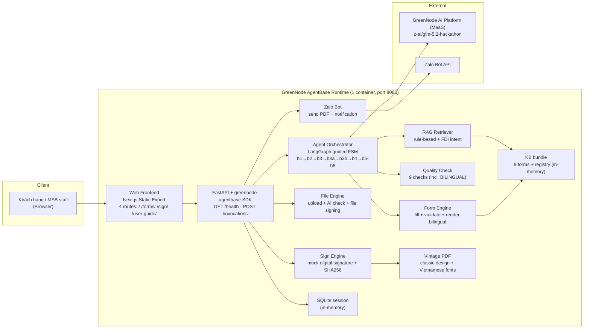
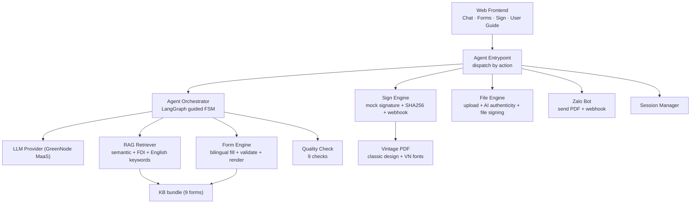
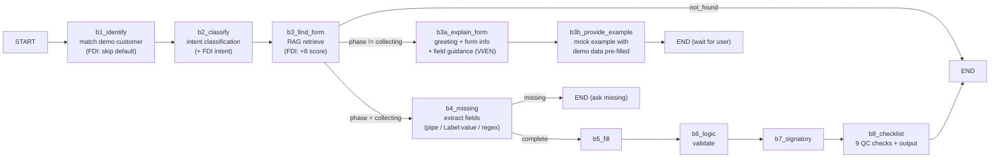
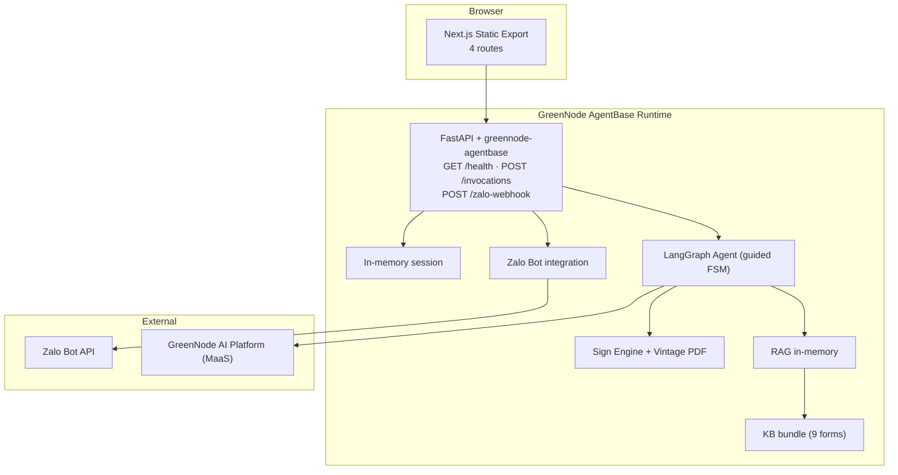

# 02 — Solution Architecture Document (SAD)

> MSB SmartForm AI · HLA + sơ đồ · v1.0 (đã deploy lên GreenNode AgentBase)

---

## 1. Tổng quan kiến trúc

MSB SmartForm AI là web app 1 container: **Frontend (Next.js static export)** + **Agent (LangGraph guided FSM)** + **Knowledge Base (RAG)** + **Form Engine** + **Sign Engine** + **Zalo Bot**. Agent điều phối luồng hội thoại có hướng dẫn, dùng RAG chọn mẫu từ Form Registry, điền mẫu, chạy 9 quality checks, sinh checklist, xuất PDF vintage, ký số, và gửi Zalo.



## 2. Component Diagram



## 3. Tech Stack

| Lớp | Công nghệ | Lý do |
|---|---|---|
| Frontend | Next.js 14 + TypeScript + Tailwind, **static export (SSG)** | 4 routes, host trong container |
| Agent | FastAPI + **greennode-agentbase SDK** + LangGraph (guided FSM) | 1 container, AgentBase Custom Agent |
| LLM | **GreenNode AI Platform (MaaS)** — z-ai/glm-5.2-hackathon | OpenAI-compatible, POC credits |
| KB (demo) | JSON/MD bundle trong container, in-memory | 9 mẫu, không cần DB |
| RAG (demo) | Rule-based + keyword scoring + FDI intent | Không cần embedding model |
| Session (demo) | In-memory dict | Đủ demo, session isolation per persona |
| PDF | fpdf2 + pypdf + vintage_pdf.py | Tạo PDF + merge signature + vintage design |
| Sign | Custom (fpdf2 + pypdf + hashlib SHA256) | Mock digital signature |
| Zalo Bot | Zalo Bot API (send PDF + text) | Gửi hồ sơ đã ký cho khách hàng |
| Container/Deploy | **GreenNode AgentBase runtime** (1 container, port 8080, `/health`) | Qua `/agentbase-deploy` |

## 4. LangGraph Guided FSM



### Conversation phases:
```
init → explaining → example_shown → collecting → complete
```

### Language detection:
- English markers ≥ 2 → English instructions
- FDI customer with non-Vietnam nationality + English markers ≥ 1 → English
- Default → Vietnamese (có dấu)

## 5. API Contract (/invocations actions)

| Action | Method | Purpose |
|---|---|---|
| `chat` | POST | Send message through guided FSM |
| `list_forms` | POST | List 9 active forms |
| `get_form` | POST | Get form template by code |
| `fill_form` | POST | Fill form with values |
| `validate_form` | POST | Validate filled form |
| `render_form` | POST | Render HTML preview |
| `run_qc` | POST | Run 9 quality checks |
| `soan_ho_so` | POST | Trigger SOẠN HỒ SƠ (checklist + file) |
| `export_vintage_pdf` | POST | Export vintage PDF from session data |
| `export_form_pdf` | POST | Export blank template PDF |
| `mock_sign_document` | POST | Sign generated PDF (signature + cert) |
| `upload_and_check` | POST | Upload file + AI authenticity check |
| `sign_uploaded_file` | POST | Sign uploaded file + vintage PDF |
| `reset_session` | POST | Reset session |
| `get_session` | POST | Get session state |
| `send_zalo_notification` | POST | Send signed PDF via Zalo Bot |
| `zalo_get_me` | POST | Check Zalo bot token |
| `zalo_set_webhook` | POST | Set Zalo webhook URL |
| `zalo_send_message` | POST | Send text message via Zalo |
| `zalo_list_chats` | POST | List known Zalo chat IDs |
| GET `/health` | GET | Health check (AgentBase contract) |
| POST `/zalo-webhook` | POST | Zalo webhook receiver |

## 6. Deployment Diagram



## 7. Scalability strategy

- Agent **stateless** → scale ngang theo số pod (AgentBase autoscale).
- Demo: KB bundle in-container, RAG in-memory → **không có DB round-trip**, RAG trên 9 mẫu < 1ms.
- Bottleneck = **LLM latency** → streaming + rule-based fallback (works without LLM).
- Session isolation: mỗi persona = session ID riêng, in-memory.

## 8. Single point of failure & mitigations

| SPOF risk | Mitigation |
|---|---|
| LLM provider down | Fallback to rule-based (classify_keywords, no LLM) |
| KB parse error | Eager singleton at import, fail fast |
| Session lost | In-memory demo; prod → AgentBase memory / DB |

## 9. Tham chiếu
- PRD: `01-PRD.md` · LLD: `03-LLD.md` · Data: `04-data-model.md` · API: `05-api-contract.md` · Security: `06-security.md` · Ops: `07-deployment-ops.md` · ADR: `08-ADR.md`
