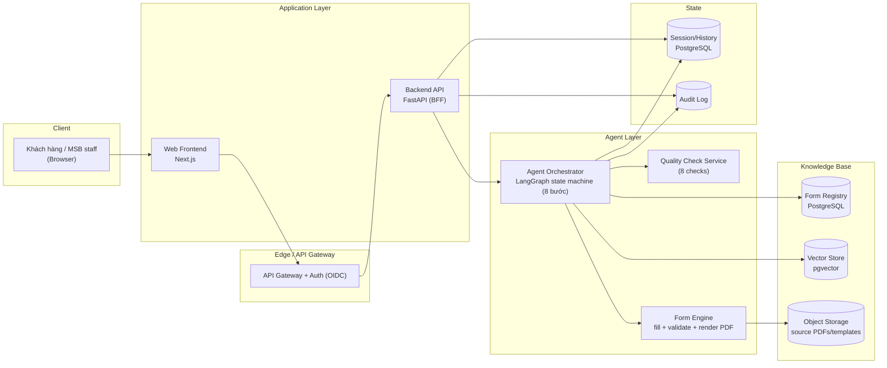
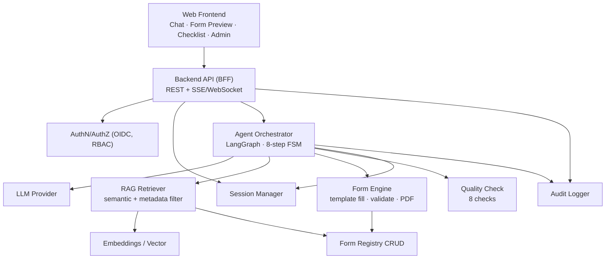
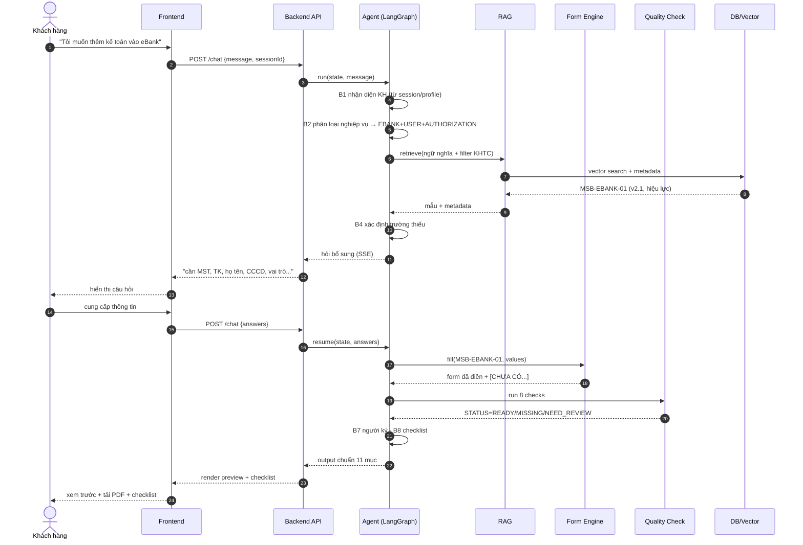
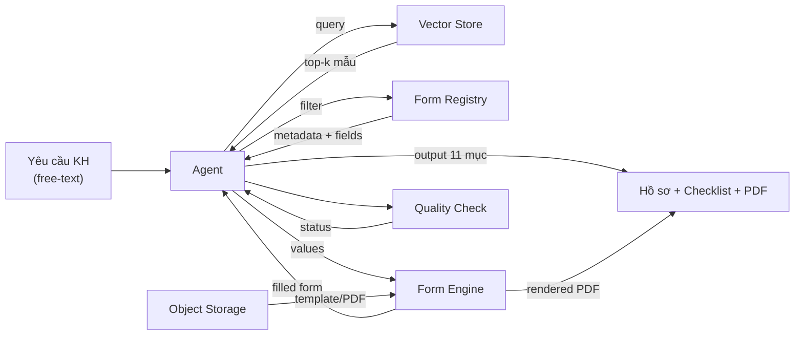
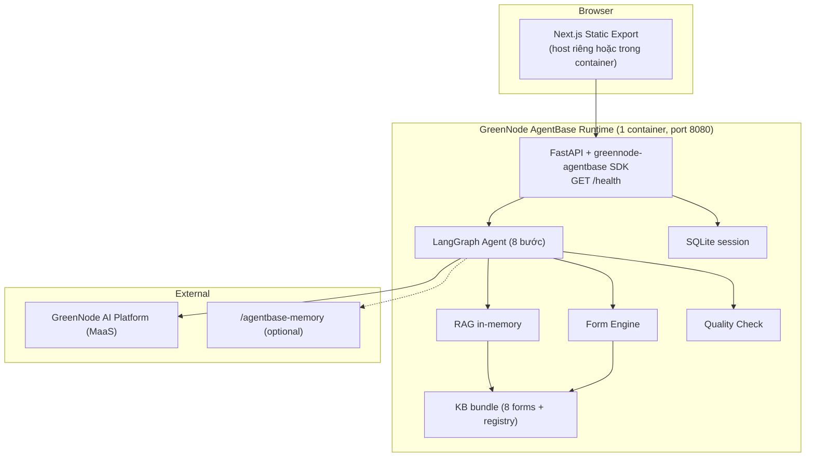
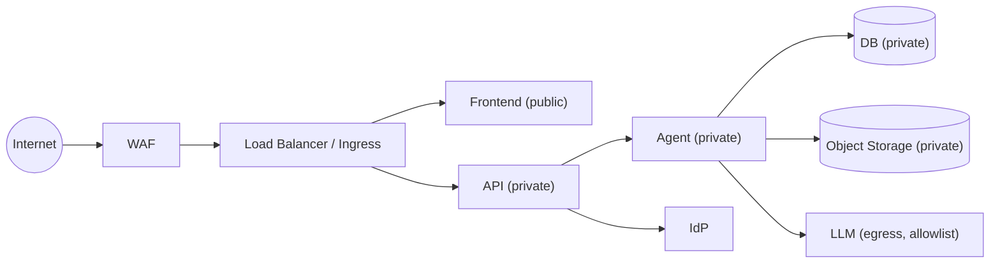

# 02 — Solution Architecture Document (SAD)

> MSB SmartForm AI · HLA + sơ đồ · v0.1

---

## 1. Tổng quan kiến trúc

MSB SmartForm AI là web app 3 lớp: **Frontend (Next.js)** → **Backend API (FastAPI)** → **Agent (LangGraph)** + **Knowledge Base (RAG)** + **Form Engine**. Agent điều phối luồng 8 bước, dùng RAG chọn mẫu từ Form Registry, điền mẫu, chạy quality check, sinh checklist.

## 2. Component Diagram

## 3. Tech Stack

| Lớp | Công nghệ | Lý do |
|---|---|---|
| Frontend | Next.js (React) + TypeScript + Tailwind, **static export (SSG)** | Chat UX, host riêng hoặc serve từ container |
| Backend + Agent | FastAPI + **greennode-agentbase SDK** + LangGraph (FSM 8 bước) | 1 container, đúng AgentBase Custom Agent model |
| LLM | **GreenNode AI Platform (MaaS)** OpenAI-compatible | Tích hợp platform, POC credits (ADR-5) |
| Form Registry (demo) | JSON/MD bundle trong container | 8 mẫu nhỏ, không cần DB bên ngoài (ADR-10) |
| Vector Store (demo) | FAISS/Chroma **in-memory** (build lúc boot) | Không cần PG bên ngoài (ADR-3) |
| Session (demo) | SQLite file (ephemeral) | Đủ demo |
| Form Registry (prod) | PostgreSQL + pgvector | Persist, scale (ADR-3/10 prod path) |
| Object Storage (prod) | S3-compatible | Lưu source PDF khi có mẫu thật |
| PDF | WeasyPrint / pdf-lib | Render form đã điền (template JSON → PDF) |
| Auth | OIDC (Keycloak demo) + JWT | RBAC 3 vai trò |
| Container/Deploy | **GreenNode AgentBase runtime** (1 container, port 8080, `/health`) | ADR-4, qua `/agentbase-wizard` + `/agentbase-deploy` |
| Memory | `/agentbase-memory` (optional) | ADR-12 |
| Observability | `/agentbase-monitor` + OpenTelemetry/Prometheus/Grafana (prod) | |
| CI/CD | GitHub Actions | |

## 4. Sequence Diagram — Luồng chính

## 5. Data Flow Diagram (DFD)

## 6. Deployment Diagram

## 7. Network Topology (logical)

## 8. Scalability strategy

- API & Agent **stateless** → scale ngang theo số pod (AgentBase autoscale min/max replicas).
- Demo: KB bundle in-container, vector in-memory, SQLite session → **không có DB round-trip**, RAG trên 8 mẫu < 1ms.
- Bottleneck duy nhất = **LLM latency** → streaming (SSE) + small model cho phân loại nhẹ.
- Prod: pgvector HNSW + cache embedding; Form Registry index; session chuyển Redis/PG.

> **Về thắc mắc latency PostgreSQL:** ở demo không dùng PG (KB in-memory), nên query gần như tức thì. Khi lên prod với pgvector + vài trăm mẫu, HNSW index vẫn < 10ms. Độ trễ người dùng cảm nhận chủ yếu từ LLM (đã stream), không từ DB.

## 9. Single point of failure & mitigations

| SPOF risk | Mitigation |
|---|---|
| LLM provider down | Fallback model + graceful degrade (chỉ tra mẫu, không điền) |
| DB down | Replica read + HA primary (prod) |
| Vector index slow | HNSW + cache; reindex offline |

## 10. Tham chiếu
- PRD: `01-PRD.md` · LLD: `03-LLD.md` · Data: `04-data-model.md` · API: `05-api-contract.md` · Security: `06-security.md` · Ops: `07-deployment-ops.md` · ADR: `08-ADR.md`
