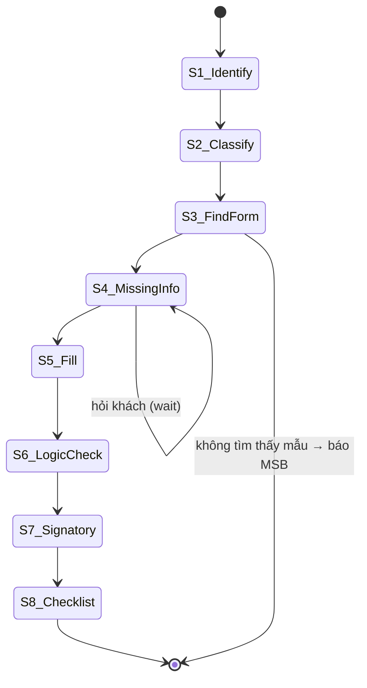
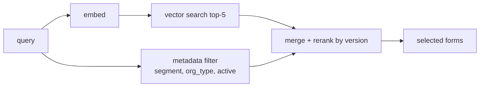
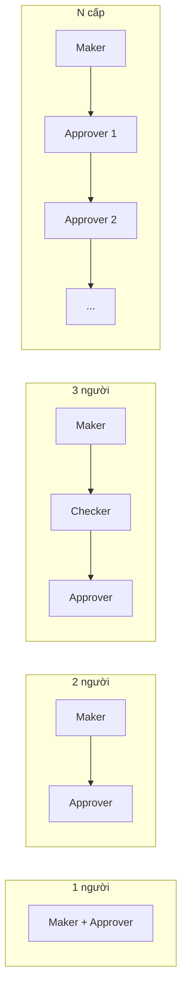

# 03 — Low-Level Design (LLD)

> MSB SmartForm AI · chi tiết từng module · v0.1

---

## 1. Agent Orchestrator (LangGraph FSM 8 bước)

State machine với 8 node, mỗi node là một tool/hàm. State lưu trong `Session`.



### State schema (JSON)
```json
{
  "session_id": "uuid",
  "customer": { "type": "org|individual", "org_type": "CP|TNHH1TV|TNHH2TV|DNTN",
                "name": "...", "tax_id": "...", "account_no": "...", "legal_rep": "..." },
  "intents": ["EBANK","USER","AUTHORIZATION"],
  "selected_forms": [{"code":"MSB-EBANK-01","version":"2.1"}],
  "collected": { "field": "value" },
  "missing": ["tax_id","account_no","cccd"],
  "filled_form": { },
  "qc_result": { "status":"READY", "checks": [] },
  "signatories": [ ],
  "checklist": [ ],
  "step": 4
}
```

### Node responsibilities
| Bước | Node | Input | Output | Tool gọi |
|---|---|---|---|---|
| 1 | Identify | message + session | customer profile | `get_session`, `ask_if_missing` |
| 2 | Classify | message | intents[] | LLM function-calling (enum intents) |
| 3 | FindForm | intents + customer | selected_forms | `rag_retrieve`, `registry_filter` |
| 4 | MissingInfo | form fields + collected | missing[], câu hỏi | `mandatory_fields(form)` |
| 5 | Fill | form + collected | filled_form | `form_engine.fill` |
| 6 | LogicCheck | filled_form | violations[] | `form_engine.validate` |
| 7 | Signatory | form metadata + customer | signatories[] | `signatory_rules(form)` |
| 8 | Checklist | forms + accompanying | checklist[] | `checklist_builder` |

---

## 2. RAG Retriever

- **Embedding model:** text-embedding (configurable, vd `bge-m3` đa ngữ).
- **Index:** pgvector HNSW trên embedding của `tên mẫu + nhóm nghiệp vụ + trường hợp sử dụng + mô tả`.
- **Retrieval:** hybrid = semantic top-k (k=5) + metadata filter (`KHCN/KHTC`, `loại hình DN`, `hiệu lực = true`).
- **Rerank:** chốt mẫu có `phiên bản` mới nhất trong cùng `mã mẫu`.
- **Guard:** nếu top-1 score < threshold → trả "Chưa xác định được mẫu...".



---

## 3. Form Engine

### Template schema (JSON, lưu trong Form Registry / object storage)
```json
{
  "code": "MSB-EBANK-01",
  "version": "2.1",
  "layout_ref": "s3://forms/MSB-EBANK-01_v2.1.pdf",
  "fields": [
    {"key":"company_name","label":"Tên doanh nghiệp","type":"text","required":true,"section":"A"},
    {"key":"tax_id","label":"Mã số thuế","type":"text","required":true,"validate":"mst_10digit"},
    {"key":"account_no","label":"Số tài khoản MSB","type":"text","required":true,"validate":"msb_account"},
    {"key":"user_name","label":"Họ tên người dùng","type":"text","required":true},
    {"key":"cccd","label":"CCCD/Hộ chiếu","type":"text","required":true,"validate":"cccd_12"},
    {"key":"role","label":"Vai trò","type":"enum","options":["Maker","Checker","Approver"],"required":true},
    {"key":"limit","label":"Hạn mức","type":"number","required":false},
    {"key":"auth_method","label":"Xác thực","type":"enum","options":["OTP","Token","SoftOTP"]}
  ],
  "signatories": [
    {"who":"legal_rep","position":"Người đại diện theo pháp luật","stamp":"optional_by_template"}
  ],
  "accompanying_docs": ["CCCD","GGĐL","Văn bản ủy quyền"],
  "fixed_content": ["logo","footer","mã mẫu","pháp lý"]
}
```

### Operations
- `fill(template, values)` → điền giá trị, trường thiếu → `[CẦN KHÁCH HÀNG CUNG CẤP]`, **không sửa** `fixed_content`.
- `validate(filled)` → chạy rule per field (MST 10 số, CCCD 12 số, TK MSB, email, ĐT VN).
- `render_pdf(filled)` → map field → vị trí trên `layout_ref` → xuất PDF.

---

## 4. Quality Check Service

8 check độc lập, chạy song song, gộp kết quả:

| Check | Logic |
|---|---|
| FORM CHECK | mẫu tồn tại, đang hiệu lực, đúng phiên bản |
| DATA CHECK | định dạng MST/CCCD/TK/email/ĐT |
| SIGNATURE CHECK | đủ người ký theo mẫu, chức danh khớp |
| AUTHORITY CHECK | người lập có quyền lập (chủ TK/ủy quyền) |
| EBANK ROLE CHECK | cấu trúc Maker/Checker/Approver hợp lệ |
| LIMIT CHECK | hạn mức > 0, trong giới hạn SP |
| MANDATORY FIELD CHECK | không còn trường required trống |
| DOCUMENT CONSISTENCY CHECK | nhất quán giữa nhiều mẫu (cùng MST/ tên DN) |

`STATUS = READY` nếu tất cả pass · `MISSING INFORMATION` nếu thiếu required · `NEED MSB REVIEW` nếu check cần người xác nhận.

---

## 5. Module eBank — bảng phân quyền

Agent sinh bảng theo cấu trúc chọn:



Output bảng: `Người dùng | Chức danh | User | Vai trò | Hạn mức | Xác thực`.

---

## 6. Module Thuế điện tử

Phân nhánh: `đăng ký mới | thay đổi TK | bổ sung TK | hủy TK | thay đổi CTS | thay đổi ĐDPL`. Mỗi nhánh map sang mẫu `MSB-ETAX-03` + tập trường riêng + hồ sơ kèm riêng.

## 7. Module Chữ ký số

Hỗ trợ: `đăng ký mới | thay đổi | gia hạn | thay đổi chứng thư | thay đổi NCC | thay đổi serial | hủy`.
Trường thu thập: `tên chủ chứng thư, MST/CCCD, NCC, serial, ngày HL, ngày hết hạn, email, ĐT`.
**Reject list (không hỏi, không lưu):** `PRIVATE KEY, PIN, PASSWORD, OTP, secret key, API key`.

---

## 8. Backend API (BFF) — endpoints tổng quan

(xem chi tiết `05-api-contract.md`)

- `POST /chat` (SSE) — gửi tin nhắn, stream trả lời Agent.
- `POST /sessions` / `GET /sessions/{id}` — quản lý phiên.
- `GET /forms` / `GET /forms/{code}` — Form Registry.
- `POST /forms/{code}/fill` — điền + validate.
- `POST /forms/{code}/render` — xuất PDF.
- `GET /forms/{code}/checklist` — checklist.
- `POST /admin/forms` — admin upload mẫu (RBAC).

---

## 9. Frontend — màn hình chính

| Màn | Chức năng |
|---|---|
| Chat | nhập yêu cầu, xem câu hỏi Agent, output 11 mục |
| Form Preview | xem trước mẫu đã điền, highlight `[CẦN CUNG CẤP]` |
| Checklist | checklist nộp hồ sơ + tải PDF |
| History | lịch sử phiên |
| Admin (RBAC) | Form Registry CRUD, upload mẫu, phiên bản |

---

## 10. Error & edge cases

| Trường hợp | Xử lý |
|---|---|
| Không tìm thấy mẫu | Trả câu chuẩn, gợi ý chuyên viên MSB |
| Mẫu hết hiệu lực | Ưu tiên phiên bản mới hơn, cảnh báo |
| Khách cung cấp bí mật | Reject + cảnh báo không lưu |
| Nhiều mẫu phù hợp | Liệt kê, hỏi khách chọn hoặc Agent chọn theo ngữ cảnh |
| LLM timeout | Streaming + fallback small model / trả partial |
