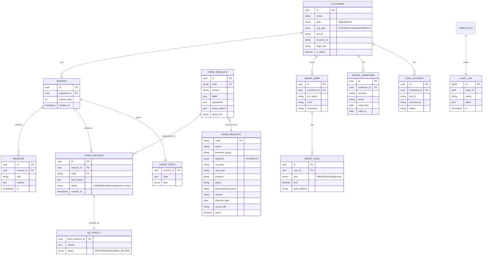

# 04 — Data Model

> MSB SmartForm AI · ER + schema + Form Registry · v0.1

---

## 1. ER Diagram

---

## 2. Form Registry — schema & 5 bản ghi giả lập

Bảng chính (đúng cấu trúc yêu cầu):

| Cột | Kiểu | Ghi chú |
|---|---|---|
| Mã mẫu | string PK (code) | vd `MSB-EBANK-01` |
| Tên mẫu | string | |
| Nhóm nghiệp vụ | string | eBank / Thuế điện tử / Chữ ký số / Tài khoản |
| KHCN/KHTC | enum | `KHCN` (cá nhân) / `KHTC` (tổ chức) |
| Loại hình DN | string | Tất cả / CP / TNHH1TV / TNHH2TV / DNTN / Cá nhân |
| Trường hợp sử dụng | text | |
| Người lập | string | |
| Người ký | string | |
| Hồ sơ kèm | text | danh sách |
| Phiên bản | string | |
| Ngày hiệu lực | date | |
| File nguồn | string | path object storage |
| active | bool | đang hiệu lực |

> Dữ liệu 5 bản ghi nằm trong `knowledge-base/form-registry.md`.

---

## 3. Validation rules (DB-level + app-level)

| Trường | Rule |
|---|---|
| `tax_id` | 10 số, check digit MST VN |
| `account_no` | định dạng số TK MSB |
| `cccd` | 12 số |
| `phone` | định dạng ĐT VN (10–11 số, đầu 0) |
| `email` | RFC 5322 |
| `serial` (CTS) | chuỗi, không chứa private key |
| `version` | semver-ish (`2.1`) |
| `effective_date` | ≤ today để `active=true` |

---

## 4. Indexing

- `form_registry(business_group, segment, org_type, active)` — filter RAG.
- `form_registry(code, version DESC)` — chọn phiên bản mới nhất.
- `session(customer_id, created_at DESC)` — history.
- pgvector HNSW trên `form_template.embedding`.

---

## 5. Retention & privacy

- `MESSAGE`, `AGENT_STATE`: bảo lưu theo phiên, purge sau TTL (demo: 7 ngày).
- `AUDIT_LOG`: 12 tháng (mục tiêu).
- Không bảng nào lưu: PIN/OTP/private key/password/secret (reject ở API layer).
- `is_demo=true` cho mọi bản ghi v0.1.
