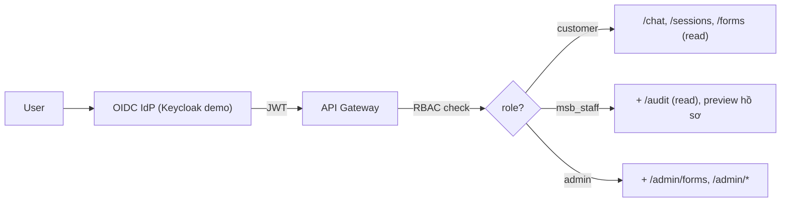
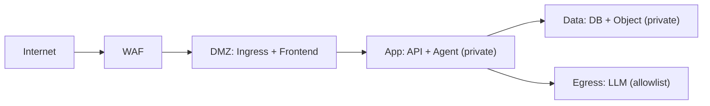

# 06 — Security Architecture

> MSB SmartForm AI · v0.1

---

## 1. Nguyên tắc

1. **Chuẩn bị, không phê duyệt** — Agent không bao giờ kết luận hồ sơ được MSB chấp thuận.
2. **Không bí mật** — PIN/OTP/private key/password/API key/secret: reject ở API layer, không log, không lưu, không hiển thị.
3. **Dữ liệu DEMO** — v0.1 chỉ dữ liệu giả lập (`is_demo=true`).
4. **Zero-trust** — mọi request phải authn + authz; service-to-service mTLS trong prod.
5. **Bảo toàn mẫu MSB** — không sửa `fixed_content` (logo, mã mẫu, footer, pháp lý).

## 2. Authentication & Authorization

- **AuthN:** OIDC (authorization code + PKCE cho web), JWT ngắn hạn + refresh.
- **AuthZ:** RBAC 3 vai trò; ABAC mở rộng cho `msb_staff` chỉ thấy hồ sơ phân nhánh mình (mục tiêu prod).
- **Session:** JWT stateless; session nghiệp vụ lưu DB.

## 3. Bí mật — reject list

| Trường | Xử lý |
|---|---|
| `pin`, `password`, `otp`, `private_key`, `secret_key`, `api_key` | API reject `SECRET_REJECTED` trước khi vào Agent; không log |
| PII (CCCD, MST, ĐT, email) | Cho phép (DEMO), mã hóa at-rest; mask trong log (`0123******`) |

Cài đặt: middleware FastAPI quét key/regex → reject; structured logging mask PII.

## 4. Encryption

- **In-transit:** TLS 1.2+ (1.3 mục tiêu); HSTS.
- **At-rest:** PostgreSQL TDE / volume encryption; object storage SSE-S3.
- **Secrets của hệ thống** (DB password, LLM key): env + secrets manager (Vault/SOPS), không commit.

## 5. Input validation & prompt injection

- API: Pydantic schema, validate mọi field (MST/CCCD/ĐT/email).
- Agent: system prompt cứng; không cho khách chèn lệnh override; giới hạn output schema.
- RAG: chỉ trả metadata/field, không execute code từ form content.

## 6. OWASP Top 10 — mapping

| Rủi ro | Mitigation |
|---|---|
| A01 Broken Access Control | RBAC + server-side check mọi endpoint |
| A02 Cryptographic Failures | TLS 1.2+, AES-256 at-rest |
| A03 Injection | Pydantic + parameterized query (SQLAlchemy) |
| A04 Insecure Design | Threat model, reject list bí mật |
| A05 Security Misconfig | IaC, no default creds, hardened images |
| A07 Auth Failures | OIDC + PKCE, JWT short-lived |
| A08 Software Integrity | Pinned deps, SBOM, CI scan |
| A09 Logging Failures | Audit log mọi action |
| A10 SSRF | Egress allowlist (chỉ LLM endpoint) |

## 7. Audit & compliance

- Mọi action (chat, fill, render, admin) → `AUDIT_LOG` (actor, action, detail, ts).
- Tuân thủ mục tiêu: ISO 27001 (control cơ bản), 12-factor app, OWASP.
- DR: backup DB + object storage; RPO 15m / RTO 1h (mục tiêu prod).

## 8. Network segmentation

- Frontend public; API/Agent private; DB/Object private; egress chỉ LLM allowlist.
- WAF: rate limit, block prompt-injection patterns, geo (mục tiêu).
