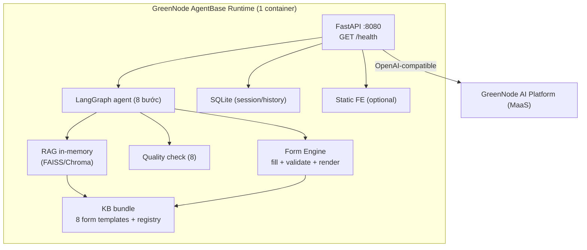
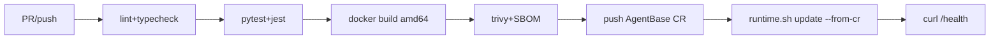

# 07 — Deployment, CI/CD, Observability, DR

> MSB SmartForm AI · v0.1 · **Deploy target: GreenNode AgentBase (Custom Agent runtime)**

---

## 1. Kiến trúc triển khai (AgentBase-aligned)

AgentBase Custom Agent = **1 container Python** (port 8080, `GET /health` → 200). Vì vậy:

- **Backend + Agent + Form Engine + RAG + QC** gộp vào **1 image** (`msb-smartform-agent`).
- **Knowledge Base bundle trong container**: 8 form template (JSON/MD) + form-registry nạp lúc startup; vector store **in-memory** (FAISS/Chroma) build lúc boot; session = **SQLite file** (ephemeral, đủ demo). → **Không cần PostgreSQL/MinIO bên ngoài cho demo.**
- **Frontend (Next.js)**: static export (SSG) — host riêng (Vercel/Netlify/any static host) gọi endpoint runtime, **hoặc** serve static từ chính FastAPI container (đơn giản nhất cho demo).

> **Latency:** demo không có DB round-trip; RAG trên 8 mẫu < 1ms; bottleneck duy nhất = LLM (stream bằng SSE). Production path → managed PostgreSQL+pgvector (vẫn <10ms với HNSW trên vài trăm mẫu).

---

## 2. Environments

| Env | Mục đích | Triển khai |
|---|---|---|
| local | Dev | `uvicorn`/`python main.py` + Next.js `dev` |
| staging/demo | Hackathon | **AgentBase runtime** (PUBLIC, flavor `1x1-general`, POC wallet) |
| prod (mục tiêu) | HA | AgentBase runtime (autoscale min1-max3) + managed PG+pgvector + object storage + VPC |

---

## 3. Deploy pipeline (qua skill `/agentbase-wizard` + `/agentbase-deploy`)

```mermaid
flowchart LR
  S1["1. Check IAM creds"] --> S2["2. Scaffold (LangGraph)"]
  S2 --> S3["3. Memory (optional)"]
  S3 --> S4["4. Identity/auth (auto-provision)"]
  S4 --> S5["5. Customize main.py"]
  S5 --> S6["6. Configure env (LLM via AIP)"]
  S6 --> S7["7. Local test (validate+local+docker)"]
  S7 --> S8["8. Deploy: build → CR → runtime"]
  S8 --> S9["9. Verify /health + endpoint"]
```

### Bước 8 chi tiết (theo `/agentbase-deploy` Part 1)
1. `docker build --platform linux/amd64 -t {registryUrl}/{repoName}/msb-smartform-agent:{tag} .`
2. `bash .claude/skills/agentbase/scripts/cr.sh credentials docker-login` (managed CR, secret không ra disk)
3. `docker push {registryUrl}/{repoName}/msb-smartform-agent:{tag}`
4. `bash .claude/skills/agentbase/scripts/runtime.sh create --name msb-smartform-agent --image  --flavor 1x1-general --from-cr --env-file .env --poc true --min-replicas 1 --max-replicas 1`
5. Poll → `ACTIVE`; lấy endpoint URL; `curl <endpoint>/health` → 200.

### Env vars (`.env`)
| Var | Nguồn |
|---|---|
| `LLM_API_KEY` | `/agentbase-llm api-keys create` (GreenNode AIP) |
| `LLM_BASE_URL` | `https://maas-llm-aiplatform-hcm.api.vngcloud.vn/v1` |
| `LLM_MODEL` | từ `/agentbase-llm models list` (chọn `modelStatus=ENABLED`) |
| `MEMORY_ID` | (optional) `/agentbase-memory create` |

**Auto-injected bởi runtime (KHÔNG tự set):** `GREENNODE_CLIENT_ID`, `GREENNODE_CLIENT_SECRET`, `GREENNODE_AGENT_IDENTITY`, `GREENNODE_ENDPOINT_URL`.

### Container contract
- Python 3.10+, `greennode-agentbase` SDK, `GreenNodeAgentBaseApp` HTTP server.
- Listen `0.0.0.0:8080`; `GET /health` → 200.
- `.dockerignore` loại `.env`, `.greennode.json`.

---

## 4. CI/CD (GitHub Actions — mục tiêu)

- `main` → update runtime (tạo version mới, DEFAULT endpoint auto-track).
- Rollback: `runtime.sh update` với image version cũ (xem `/agentbase-deploy` Rollback).

---

## 5. Observability

| Pillar | Demo | Prod (mục tiêu) |
|---|---|---|
| Logs | `/agentbase-monitor` runtime logs | + Loki structured (PII masked) |
| Metrics | `/agentbase-monitor` dashboard | Prometheus + Grafana |
| Traces | — | OpenTelemetry → Jaeger |
| Uptime | `GET /health` | Uptime probe |

Dashboards: chat latency/throughput · RAG form selection · QC status · LLM tokens/cost.

---

## 6. Health & readiness
- `GET /health` → 200 (AgentBase contract).
- `GET /readyz` → LLM reachability (+ DB nếu prod).

---

## 7. DR
- **Demo:** stateless container, KB bundle trong image → redeploy = restore. Session ephemeral (chấp nhận).
- **Prod (mục tiêu):** managed PG PITR + snapshot; object storage versioning; RPO 15m / RTO 1h; runtime autoscale + rollback via `runtime.sh`.

---

## 8. Cost (demo)
| Hạng mục | Demo |
|---|---|
| AgentBase runtime (1x1-general, POC wallet) | POC credits |
| LLM tokens (GreenNode AIP) | ~$ vài / demo |
| Frontend static host | free tier |
| **Tổng** | ≈ 0 (POC) |

---

## 9. Technology radar
| Tech | Trạng thái |
|---|---|
| LangGraph | Adopt |
| FastAPI + greennode-agentbase SDK | Adopt |
| GreenNode AgentBase runtime | Adopt (deploy target) |
| GreenNode AI Platform (MaaS) | Adopt (LLM) |
| In-memory vector (FAISS/Chroma) | Adopt (demo) → pgvector (prod) |
| Next.js (static export) | Adopt |
| `/agentbase-memory` | Trial (optional) |
| Managed PG+pgvector | Trial → Adopt (prod) |
| Terraform / VPC mode | Trial → Adopt (prod) |
