# 10 — UI/UX Design

> MSB SmartForm AI · Design system + wireframe (PlantUML salt) + luồng (PlantUML) · v0.1
> Logo: **kim cương đỏ** (giữ tinh chất hàng hải của MSB) — xem `docs/assets/logo-diamond.svg`

---

## 1. Nguyên tắc thiết kế

| Nguyên tắc | Áp dụng |
|---|---|
| **Conversation-first** | Chat là trung tâm; mọi nghiệp vụ giải qua 1 luồng hội thoại |
| **Progressive disclosure** | Chỉ hỏi trường thiếu; 8 bước rút gọn thành 1 thanh tiến trình |
| **Trust & compliance** | Logo MSB, mã mẫu/phiên bản hiển thị rõ; Agent không phê duyệt |
| **Status luôn rõ** | QC STATUS (READY/MISSING/NEED_REVIEW) màu hóa mọi nơi |
| **Vietnamese-first** | Font Be Vietnam Pro; label tiếng Việt; số/CCCD/MST format VN |
| **Accessible** | WCAG AA, contrast ≥ 4.5:1, focus ring, keyboard nav, ARIA |

---

## 2. Design System

### 2.1 Color

| Token | Hex | Dùng |
|---|---|---|
| `--red-600` (primary) | `#E11D2A` | Diamond logo, CTA chính, brand |
| `--red-500` | `#FF3B3B` | Gradient đầu |
| `--red-700` | `#B0151F` | Gradient cuối, hover |
| `--red-50` | `#FFF1F2` | Nền nhấn nhẹ |
| `--gold-400` | `#FFB800` | Sparkle điểm nhấn diamond |
| `--slate-900` | `#0F172A` | Text chính |
| `--slate-700` | `#334155` | Text phụ |
| `--slate-500` | `#64748B` | Muted |
| `--slate-200` | `#E2E8F0` | Border |
| `--slate-100` | `#F1F5F9` | Nền card |
| `--slate-50` | `#F8FAFC` | Nền trang |
| `--white` | `#FFFFFF` | Surface |
| `--success` | `#16A34A` | READY |
| `--warning` | `#F59E0B` | MISSING INFORMATION |
| `--info` | `#2563EB` | NEED MSB REVIEW |
| `--danger` | `#DC2626` | Lỗi / bí mật bị reject |

Gradient brand: `linear-gradient(135deg, #FF3B3B 0%, #E11D2A 55%, #B0151F 100%)`.

### 2.2 Typography
- **Display/H1:** Be Vietnam Pro 800, 32–40px
- **H2:** 700, 22–26px
- **Body:** 400, 15–16px, line-height 1.6
- **Small/Label:** 500, 13px, uppercase, letter-spacing 0.04em
- **Mono (mã mẫu, MST, CCCD):** JetBrains Mono 500
- **Chat (Agent):** 15px, nền `--slate-50`, border-left 3px `--red-600`

### 2.3 Spacing & Radius
- Scale 4px: 4/8/12/16/24/32/48
- Radius: card 16px, button 10px, chip 999px, input 10px
- Shadow: card `0 1px 3px rgba(15,23,42,.08)`, hover `0 8px 24px rgba(15,23,42,.12)`

### 2.4 Components
| Component | Mô tả |
|---|---|
| `DiamondLogo` | SVG kim cương đỏ + anchor; size 24–120px |
| `StepBar` | 8 chấm; chấm hiện = đỏ gradient, chấm qua = xanh nhạt, chấm tới = xám |
| `ChatBubble` | Agent (trái, nền slate, border-left đỏ) / User (phải, nền đỏ gradient, text trắng) |
| `FormCard` | Thẻ mẫu: mã (mono), tên, phiên bản chip, ngày hiệu lực, badge active |
| `FieldRow` | label + input/enum; required = chấm đỏ; thiếu = nền `--warning` nhạt + `[CẦN CUNG CẤP]` |
| `StatusBadge` | READY (xanh) / MISSING (amber) / NEED_REVIEW (xanh dương) |
| `ChecklistItem` | checkbox + label + required badge + icon tài liệu |
| `SignatoryCard` | tên + chức danh + vị trí ký + đóng dấu (Có/Không/?) |
| `PermissionTable` | eBank: Người dùng \| Chức danh \| User \| Vai trò \| Hạn mức \| Xác thực |
| `PrimaryButton` | đỏ gradient, radius 10, hover darken, focus ring 2px red-300 |
| `Toast` | thông báo (success/info/error), auto-dismiss 5s |

---

## 3. Logo — Kim cương đỏ

**Concept:** giữ "tinh chất hàng hải" của logo tròn MSB (mỏ neo) nhưng chuyển từ **vòng tròn → hình kim cương (diamond/rhombus)**, màu đỏ brand, có sparkle vàng ở đỉnh.

- File mark: `docs/assets/logo-diamond.svg` (200×200, scale bất kỳ)
- File wordmark: `docs/assets/logo-diamond-wordmark.svg` (`MSB SmartForm` + tagline)
- Favicon: dùng mark ở 32×32.

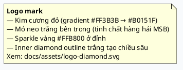

> Variant dự phòng: nếu muốn tối giản, thay mỏ neo bằng monogram "MSB" trắng in đậm giữa diamond.

---

## 4. Information Architecture (Sitemap)

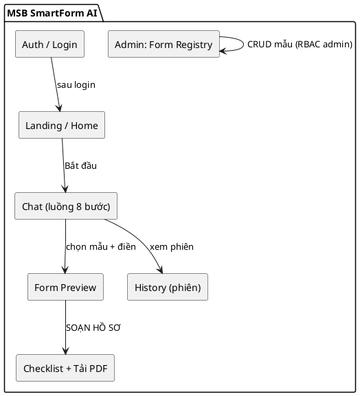

---

## 5. Luồng người dùng (User Journey)

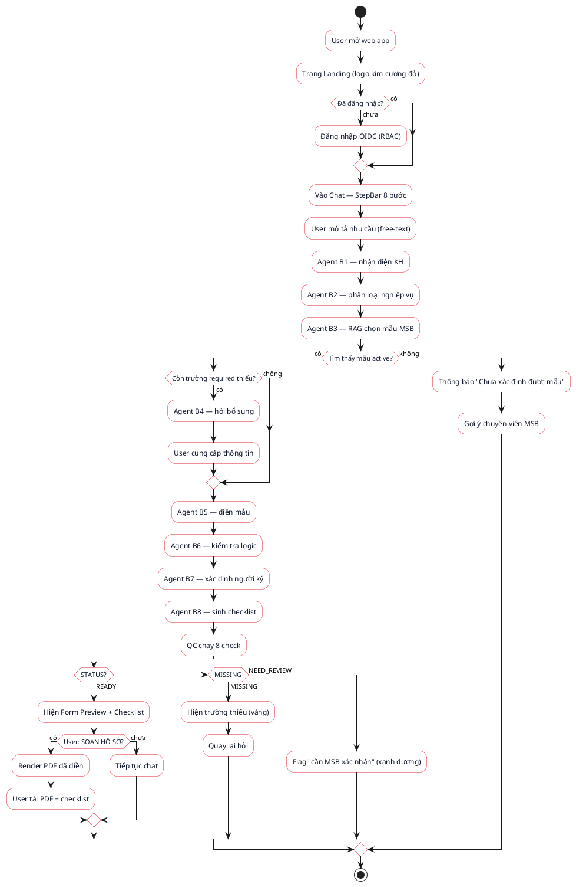

---

## 6. Luồng 8 bước (State Machine)

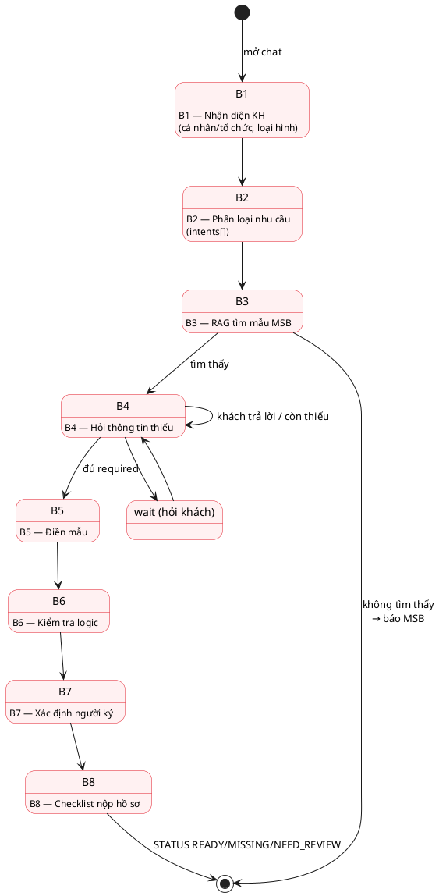

---

## 7. Luồng tương tác Chat (Sequence)

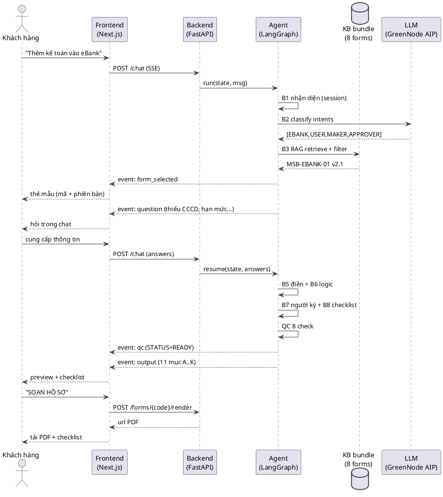

---

## 8. Wireframe — PlantUML Salt

### 8.1 Landing / Home

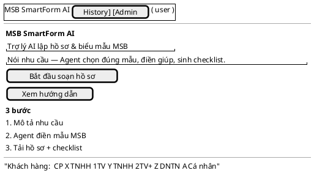

### 8.2 Chat (màn hình chính — luồng 8 bước)

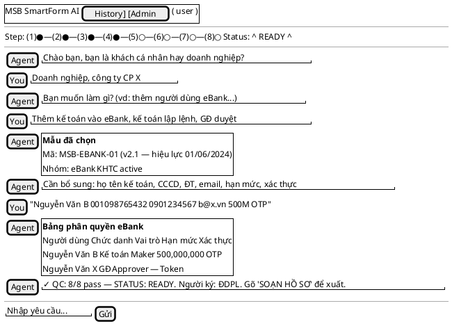

### 8.3 Form Preview + Checklist

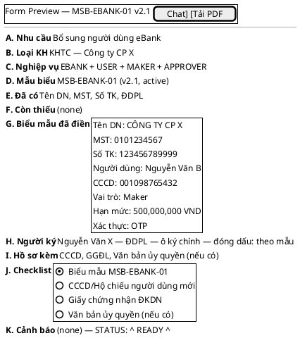

### 8.4 History & Admin

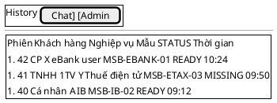

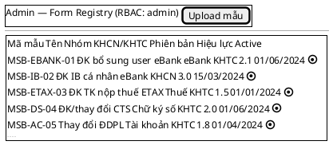

---

## 9. Luồng trạng thái STATUS (QC)

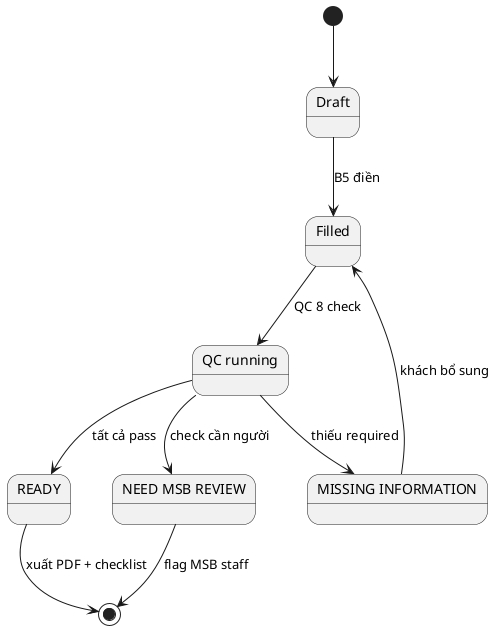

---

## 10. Responsive & Accessibility

### Responsive
| Breakpoint | Layout |
|---|---|
| ≥ 1024px (desktop) | Chat 2 cột: hội thoại (trái 60%) + panel mẫu/checklist (phải 40%) |
| 768–1023 (tablet) | 1 cột; panel mẫu chuyển thành drawer phải |
| < 768 (mobile) | 1 cột; StepBar rút thành "Bước 4/8"; checklist collapse |

### Accessibility
- Contrast: text trên đỏ gradient = trắng (ratio ≥ 4.5:1); text chính slate-900 trên white (16:1).
- Focus ring 2px `--red-300` trên mọi interactive; tab order trái→phải, trên→dưới.
- Chat: `role="log" aria-live="polite"` cho stream Agent; mỗi bubble `aria-label`.
- StepBar: `role="progressbar"` + `aria-valuenow`.
- Form: label liên kết input; required `aria-required`; lỗi `aria-describedby` + `role="alert"`.
- StatusBadge: icon + text (không chỉ màu) → daltonism-safe.
- Keyboard: Enter gửi chat; Esc đóng drawer; ↑↓ history.

---

## 11. Microinteractions & UX detail

| Điểm | Hành vi |
|---|---|
| Logo | Diamond xoay nhẹ 1 lần khi app load; sparkle nhấp nháy 2s |
| Agent typing | 3 chấm đỏ nhảy trong bubble; stream token real-time (SSE) |
| Form selected | Thẻ mẫu slide-in từ phải + shimmer; mã mẫu mono |
| Field thiếu | Nền `--warning` nhạt + chip `[CẦN CUNG CẤP]` rung nhẹ 1 lần |
| QC pass | 8 check tick lần lượt (stagger 80ms); STATUS badge pop |
| SOẠN HỒ SƠ | Nút đỏ gradient; click → skeleton preview → PDF ready → confetti nhẹ |
| Bí mật reject | Toast danger "Không lưu PIN/OTP/private key" + rung input |
| Tải PDF | Progress ring → "Tải về" button; filename `MSB-EBANK-01_filled.pdf` |

---

## 12. Tham chiếu
- Luồng nghiệp vụ: `03-LLD.md` (FSM 8 bước) · Use case: `09-use-cases.md`
- Logo: `docs/assets/logo-diamond.svg`, `docs/assets/logo-diamond-wordmark.svg`
- Render PlantUML: paste block vào https://www.plantuml.com/plantuml/uml/ hoặc VS Code extension "PlantUML".
